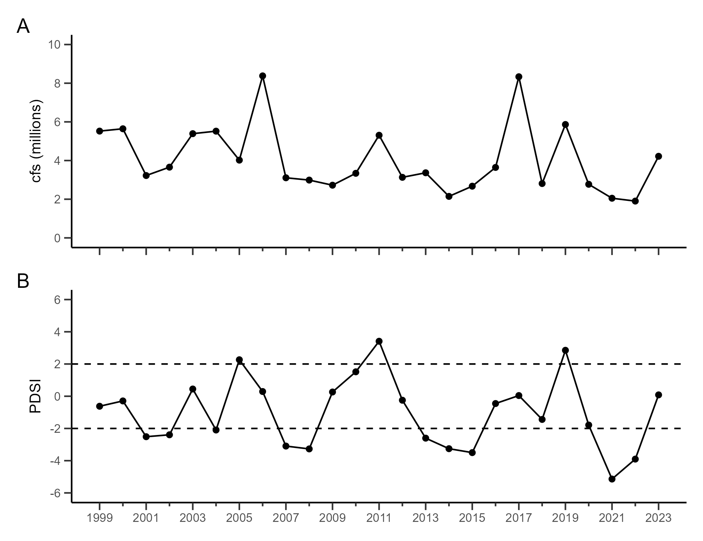

# INTRODUCTION

* Bank Swallow background, conservation need

* Prior research findings; gaps in research and need for this study 
  * a lot of prior Sacramento Valley research on colony size dynamics and probability of colonization/extinction/persistence of individual colonies as opposed to total population size (with the exception of PVAs)
  * evidence for effects of river flow/management on Bank Swallow population dynamics mixed, but focused on the immediate effects of flow on population size the following breeding season:
     * probability of colonization & extinction both increased with max river discharge in the previous year (March 15-March 14), but suggested a net positive [@wrightBurrowOccupancyNesting2011]
     * mean winter flow and peak flow (Dec-Apr) were both poor predictors of the number of colonies and their size (# of burrows) [@garciaSpatialTemporalPatterns2009]
  * there is a need to consider time-lagged/indirect effects of flows on reproductive success and subsequent growth in the population size
  
**Approach and objectives:** evaluate long-term trends and the role of stream flow in Bank Swallow population dynamics, incorporating time-lagged effects and looking at the entire Bank Swallow population as a whole

# METHODS

**Study area & study species**

* Map (Figure 1)

* Climate, hydrology, definition of "water year" (i.e. BANS breeding season takes place toward the end of the water year, and follows the rainy season)  

* Breeding biology, timing, migratory status, conservation status, diet  

* Assumption that the number of burrows counted is a useful index of population size  

**Bird surveys**

* survey methods, timing  

* variations in protocol over time  

* focusing this analysis on surveys since 1999  

**Conceptual model and hypotheses.** We developed a conceptual model illustrating hypothesized effects of environmental covariates and density dependence on Bank Swallow population dynamics, through their effects on survival and reproductive success (Figure 2). We assumed that the per-capita population growth rate in the number of Bank Swallow burrows between subsequent breeding seasons t and t+1 was directly influenced by reproductive success in year t and/or by survival during the non-breeding season between years t and t+1. Studies of the dynamics of Bank Swallow populations that migrate between Europe and Africa have found strong effects of adult survival [@normanDensitydependentSurvivalRecruitment2013; @imlayBreedingPhenologyPerformance2018], which is in turn driven by patterns of drought and subsequent food availability during the non-breeding season [@cowleyLongtermVariationSurvival2005; @normanDensitydependentSurvivalRecruitment2013;  @mondain-monvalClimaticConditionsMigration2020a]. In contrast, reproductive success had a strong impact on the dynamics of a population that migrates between the northeastern United States and South America [@imlayBreedingPhenologyPerformance2018]. Although reproductive success in Bank Swallows is not generally expected to be food-limited [@garrisonBankSwallowRiparia1998], drought conditions could affect food availability and nestling survival, particularly in California's Mediterranean climate [@dybalaProjectingDemographicResponses2013]. In addition, breeding performance is likely to be driven by variation in quantity and quality of available nesting habitat [@girvetzRemovingErosionControl2010].  

On the Sacramento River, Bank Swallows establish nest colonies on steep river banks formed by periods of high river flow with sufficient power to cause bank erosion. Continual erosion is necessary to create and maintain high quality nesting habitat; freshly eroded cut banks less than 2-3 years old tend to have steeper slopes that limit predator access to nest burrows (especially gopher snakes), and less opportunity for a build up of parasite loads that reduce reproductive success [@garrisonBankSwallowRiparia1998; @garciaSpatialTemporalPatterns2009]. Installation of revetment to eliminate erosion on river banks permanently removes potential nesting habitat from the Sacramento River system.  

For this study, we focused on the role of environmental conditions and population density on reproductive success and subsequent variation in the population growth rate. We hypothesized that reproductive success in water year (t) would be: 
  1) higher following periods with more high stream flow and bank erosion; 
  2) lower under drought conditions, due to potentially limited food availability; and
  3) lower when the total population size is larger, due to density-dependent fecundity in large Bank Swallow colonies [@girvetzRemovingErosionControl2010].  
  

We were unable to address the effects of changes in the amount of revetment in the study area, or of environmental conditions during the non-breeding season and impacts on survival rates. Although much of the revetment in the study area has been mapped, annual totals of the extent of revetment have not been compiled for this study period. In addition, data on migratory connectivity for this population are as yet unavailable. Thus, we incorporated a term in our model to account for unidentified sources of variation. However, we note that this modeling effort could be readily revised to incorporate these and other data as they become available.  

**Covariates.** To represent Hypothesis 1, we compiled mean daily streamflow data from four river gauges on Sacramento River, spanning the length of the study area: Vina Bridge (VIN), Hamilton City (HMC), Ord Ferry (ORD), and Butte City (BTC) (Figure 1) (cite source: https://cdec.water.ca.gov/dynamicapp/wsSensorData). River flows above a threshold of approximately 14-15,000 cfs are directly associated with bank erosion and increased availability of suitable nesting habitat for Bank Swallows [@larsenCumulativeEffectiveStream2006; bans-tacBankSwallowRiparia2013]. Thus, following Larsen et al. (@larsenCumulativeEffectiveStream2006), we calculated the sum total of the daily mean flow above a threshold value during a given water year (Oct 1 - Sept 30). We used a threshold of 14,000 cfs, consistent with recommendations from the Bank Swallow Technical Advisory Committee [@bans-tacBankSwallowRiparia2013]. For each gauge, we calculated the annual flow totals, and then because the four stations were highly correlated with each other, we calculated the mean value across all four stations. For this analysis, we considered effects on reproductive success in year (t) of both high stream flows during the same water year (*annual.flow*, t), which would increase the quantity of freshly cut, high quality nest habitat, and the cumulative total of high flows over 3 water years (*cumulative.flow*, water years t-2 to t), which would expand the total quantity of suitable nesting habitat.  

To represent Hypothesis 2, we compiled monthly values for the Palmer Drought Severity Index (PDSI) from NOAA for the "Sacramento Drainage" climate division in California. The PDSI incorporates monthly temperature, precipitation, and soil-water holding capacity data to represent the severity of dry and wet spells, with values of 2 and higher considered moist and values of -2 and lower considered to represent drought (Palmer 1965). We expected moist conditions to correspond with greater availability of insect prey for nestling Bank Swallows [*citations?*]. For each water year, we calculated the mean of the monthly PDSI values for the Bank Swallow breeding season, April through August (*mean.PDSI*).  

Finally, to represent Hypothesis 3, we used annual burrow count totals to represent the annual population size (*N*) and as a predictor of the effect of density-dependence on the population growth rate.  

We ln-transformed the flow metrics to reduce the influence of few years with extreme values, and then for all covariates, we centered and scaled the values to have a mean of zero and standard deviation equal to the range between the maximum and minimum values.  

**Population model.** To evaluate the relative importance of each of our hypotheses, we modeled the observed per-capita population growth rate from year *t* to year *t + 1* ($r_t$) as:

$$ r_t \sim Normal(\mu_{rt}, \sigma_o^2) $$

$$ \mu_{rt} = r_0 + k_t * N_t + \beta_1 * annual.flow_t + \beta_2 * cumulative.flow_t + \beta_3 * pdsi_t + \beta_4 * t + \epsilon_t $$

where $r_0$ represents the intrinsic growth rate of the population, $N_t$ is the observed burrow count in each year, $k_t$ represents the strength of the density-dependent effect on $r_0$ in each year, and $\beta_1$, $\beta_2$, and $\beta_3$ represent the effects of *annual.flow*, *cumulative.flow* and *mean. pdsi*, respectively, on $r_0$. In addition, we incorporated $\beta_4$ to account for any long-term trend in the population growth rate, and $\epsilon_t$ to account for additional unidentified sources of variation in the growth rate. 

We treated $\epsilon_t$ as a mean-zero normal random variable with constant variance $\sigma_p^2$:

$$ \epsilon_t \sim Normal(0, \sigma_p^2) $$

We modeled the strength of the density dependent effect, $k_t$, as a normal random variable with mean $\mu_{kt}$ and variance $\sigma_k^2$:

$$ k_t \sim Normal(\mu_{kt}, \sigma_k^2)$$

We estimated the posterior distributions for all model parameters using Markov chain Monte Carlo (MCMC) implemented in JAGS 4.0.0 using the R package *rjags* [@plummerJAGSProgramAnalysis2003; @plummerRjagsBayesianGraphical2018; @rcoreteamLanguageEnvironmentStatistical2020]. We used vague normal prior distributions for parameters $r_0$, $\mu_{kt}$, and all $\beta$ (mean 0, variance 10^3). We used a vague uniform prior distribution for all variances, $\sigma_o^2$, $\sigma_p^2$, and $\sigma_k^2$ (ranging 0 to 2).  

We fit 3 chains, each with 20,000 initial samples discarded for adaptation and burn-in. We accumulated an additional 50,000 samples from each chain, retaining every 25th sample. We evaluated convergence of the three chains using the Gelman-Rubin diagnostic (Gelman and Rubin 1992, r < 1.05) and visually inspecting the trace plots. We report the medians and 95% highest posterior density intervals (HPDI) for all model parameters, as well as the proportion of samples for which model parameters $\beta_1$, $\beta_2$, $\beta_3$, $\beta_4$, and $\mu_{kt}$ were greater than or less than zero, which is directly interpreted as the probability that the parameter is non-zero.  

# RESULTS

**Bird surveys.**
Summary of burrow count change/pgr overall and during the specific study period (1999-2020)  (Figure 3)

**Covariates.** The annual sum of daily mean stream flow data above a threshold of 14,000 cfs averaged 1.03 million cfs, ranging from lows of 11,818 cfs in WY2020 (1 October 2019 - 30 September 2020) and 24,104 cfs in WY2014, to highs of 4.09 million cfs in WY2006 and 4.36 million cfs in WY2017 (Figure 4). The cumulative sum over 3 consecutive water years averaged 3.55 million cfs, ranging from a low of 0.41 million cfs for the periods WY2012-2014 and WY2007-2009, to high values of 9.28 million cfs for the period WY1997-1999 and 8.63 million cfs for WY1998-2000. The annual average of monthly Palmer Drought Severity Index (PDSI) values during the breeding season (April - August) averaged -0.75, ranging from a low of -3.5 in 2015 to a high of 3.41 in 2011; only 3 years had average values >2, the threshold for moist conditions (2011, 2019, and 2005), while 8 years had average values < -2, the threshold for drought conditions. There were no strong correlations among these three covariates, and no clear long-term trends in any of these three covariates. However, California's extreme drought was detectable in all three metrics, 2013-2016.  

**Population modeling.** We found strong evidence supporting Hypothesis 1, with a positive effect of *cumulative.flow* on per-capita population growth rates (p = 0.98), as well as some evidence for an additional positive effect of *annual.flow* (p = 0.76; Figure 5). We found little evidence for Hypothesis 2, with only weak support for a non-zero, positive effect of *mean.pdsi* (p = 0.66). Hypothesis 3 was strongly supported, with a negative effect of the number of burrows in year t on growth from t to t + 1 (p = 0.99). Finally, we found only weak evidence for a long-term, declining trend in population growth rates (p = 0.62). Based on the relatively high burrow count in 2020 and relatively low values for each of the predictors, we forecasted the population growth rate from 2020 as -0.38 (95% HPDI -0.89–0.17), resulting in a forecasted burrow count for 2021 of YYY (95% HPDI LL-UU; Figures 2-3).

# DISCUSSION

* no info on migratory connectivity for this population  

* role of revetment; incorporating that info would be helpful  

* note lack of wet years for evaluating effect of PDSI; other metrics may be more helpful here? e.g. more direct insect abundance data; pesticide application data?  

# Acknowledgements

XXX

# Author contributions

XXX

# Data availability statement

XXX

\clearpage

\newpage
<!-- { width=100% } -->

**Figure 1: Map of study area.**
* With burrow locations?
* With breeding/wintering range?

\clearpage

\newpage
**Figure 2.** Conceptual model for the annual variation in Bank Swallow per-capita growth rates, showing the three hypotheses evaluated in this analysis: H1. Effects of high flow events on the quantity and quality of available nest habitat; H2. Effects of drought conditions during the breeding season on food availability; and H3. Density-dependence. Effects on survival could not be evaluated due to a lack of information on migratory connectivity. See methods for details. 

{ width=100% }

\clearpage

\newpage

**Figure 3.** Variation in observed annual per-capita growth rates and burrow counts, 1999-2020 (red), shown with median (black) and 95% highest posterior density intervals (gray) for predicted per-capita growth rates and burrow counts in each year. Model predictions are based on observed values for 1999, then use parameter estimates for each covariate and observed burrow counts to forecast the per-capita population growth rate from each year and the burrow count for the following year. Forecasted values include the burrow count in 2006 based on the expected growth rate from 2005, but for which there were no surveys conducted, and the forecasted burrow count for 2021, based on the expected growth from 2020. Predicted values for the growth rate from 2006 were back-calculated from the observed burrow count in 2007 and the predicted burrow count in 2006.

{ width=100% }  

\clearpage

\newpage
**Figure 4.** Annual variation in candidate covariates of population growth: (A) *annual.flow*, the total of mean daily stream flow above a threshold of 14,000 cfs for each water year (October 1 - September 30), (B) *cumulative.flow*, the rolling sum of *annual.flow* for 3 water years, and (C) mean monthly Palmer Drought Severity Index for the breeding season (April - August) each year.

{ width=100% }

\clearpage

\newpage

**Figure 5.** Partial effects plots for each covariate: (A) *annual.flow*, the total of mean daily stream flow above a threshold of 14,000 cfs for each water year (October 1 - September 30), (B) *cumulative.flow*, the rolling sum of *annual.flow* for 3 water years, (C) mean monthly Palmer Drought Severity Index for the breeding season (April - August) each year, and (D) year.

{ width=100% }  

\clearpage

\newpage

# References

